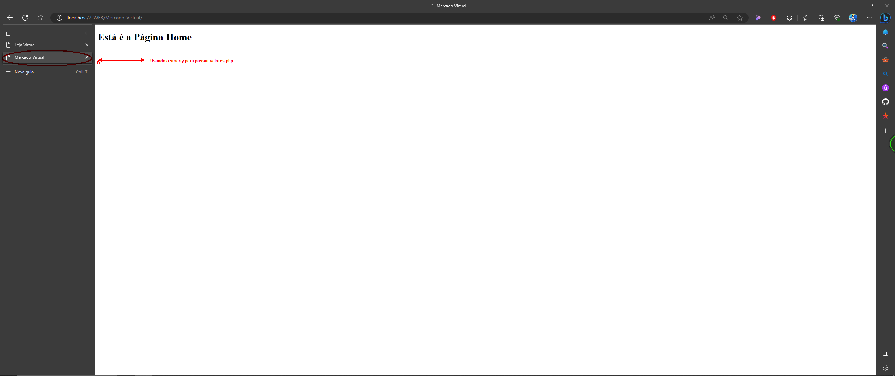

00.001 - [backend] - Como usar o  método assign do smarty

# Documentação do Template HTML com Smarty

O template HTML com Smarty é uma estrutura que permite a separação da lógica de apresentação do código PHP. Ele utiliza o mecanismo de template fornecido pela biblioteca Smarty para criar páginas dinâmicas com facilidade.

## Estrutura Básica do Template

O código do template segue a estrutura tradicional de um documento HTML. A seguir está um exemplo da estrutura básica do template:

```html
<!DOCTYPE html>
<html lang="en">
<head>
    <meta charset="UTF-8">
    <meta name="viewport" content="width=device-width, initial-scale=1.0">
    <title>{$TITULO_SITE}</title>
</head>
<body>
    <h1>Está é a Página Home</h1>
</body>
</html>
```

## Utilização no código html (tpl):

1. `{$TITULO_SITE}`: Essa é uma variável do Smarty que será substituída pelo valor atribuído a ela no código PHP antes de exibir o template final. No exemplo, essa variável representa o título do site, definido na classe `Config` através da constante `SITE_TITULO`.

## Utilização no Código PHP

Para utilizar o template HTML com Smarty, são necessárias as seguintes etapas:

1. Incluir o carregador automático das classes do Smarty:

```php
require './lib/autoload.php';
```

2. Instanciar um objeto da classe `Template` do Smarty. Isso cria um novo objeto $smarty que será usado para manipular e exibir o template.

```php
$smarty = new Template();
```

3. Atribuir valores às variáveis do template, se necessário.  Isso permite que o valor da constante SITE_TITULO seja utilizado no template para exibir o título do site. Você pode adicionar outros valores ao template, se necessário, antes de exibi-lo. Basta utilizar o método assign do objeto $smarty para atribuir os valores desejados:

```php
$smarty->assign('TITULO_SITE', Config::SITE_TITULO);
```

4. Exibir o template. Finalmente, o template index.tpl é exibido usando o método display do objeto $smarty. Isso faz com que o Smarty renderize o template e exiba o resultado final no navegador. 

```php
$smarty->display('index.tpl');
```

Nesse exemplo, o valor da constante `SITE_TITULO` da classe `Config` é atribuído à variável `TITULO_SITE` do template, permitindo que seja exibido como título da página.

## Vantagens do Template HTML com Smarty

- Separação da lógica de apresentação: O template HTML com Smarty permite separar a lógica de apresentação do código PHP, facilitando a manutenção e a organização do código.

- Reutilização de código: É possível criar templates reutilizáveis que podem ser utilizados em diferentes partes do site, evitando duplicação de código.

- Flexibilidade na apresentação: O Smarty oferece recursos avançados de formatação e manipulação de dados, permitindo a criação de apresentações dinâmicas e personalizadas.

- Segurança: O Smarty ajuda a evitar problemas de segurança, como a execução de código malicioso ou injeção de scripts, ao fazer a separação clara entre lógica e apresentação.

O template

 HTML com Smarty é uma ferramenta poderosa para o desenvolvimento de páginas dinâmicas em PHP, permitindo uma separação clara entre a lógica de negócio e a apresentação, resultando em um código mais organizado e de fácil manutenção.

Veja como ficou os arquivos:

Aqui foi definida o constante php, neste caso, `SITE_TITULO`.

___Config.class.php___ 
```PHP
<?php
class Config{

    // INFORMAÇÕES BÁSICAS DO SITE;
    const SITE_URL = "http://localhost/2_WEB";
    const SITE_PASTA = "Mercado-Virtual";
    const SITE_TITULO = "Mercado Virtual";
    const SITE_EMAIL_ADM = "mercadovirtual@gmail.com";
 
    // INFORMAÇÕES DO BANCO DE DADOS
    const BD_HOST = "localhost";
    const BD_USER = "root";
    const BD_SENHA = "";
    const BD_BANCO = "mercadovirutal";
    const BD_PREFIX = "mvweb_";

    // INFORMAÇÕES PARA PHP MAILLER
    const EMAIL_HOST = "smtp.gmail.com";
    const EMAIL_USER = "mercadovirtual@gmail.com";
    const EMAIL_NOME = "Contato Mercado Virtual";
    const EMAIL_SENHA = "";
    const EMAIL_PORTA = 587;
    const EMAIL_SMTPAUTH = true;
    const EMAIL_SMTPSECURE = "tls";
    const EMAIL_COPIA = "mercadovirtual@gmail.com";
}
?>
```
A qui acontece a atribuição do valor da constante `SITE_TITULO` da classe Config à variável `TITULO_SITE` do template:

___index.php___
```PHP
<?php 
require './lib/autoload.php';
$smarty = new Template();
$smarty->assign('TITULO_SITE', Config::SITE_TITULO);

$smarty->display('index.tpl');
 ?>
```
O trecho `{$TITULO_SITE}` é uma variável do Smarty que foi definida na index.php usando o método `assign()`. No momento da renderização do template, o valor atribuído a essa variável será inserido nesse local. No caso, o valor será o título do site definido na classe Config através da constante `SITE_TITULO`.

___index.tpl___

```HTML
<!DOCTYPE html>
<html lang="en">
<head>
    <meta charset="UTF-8">
    <meta name="viewport" content="width=device-width, initial-scale=1.0">
    <title>{$TITULO_SITE}</title>
</head>
<body>
    <h1>Está é a Página Home</h1>
</body>
</html>
```

Imagens Ilustrativas:
=========

__antes__


__despois__

